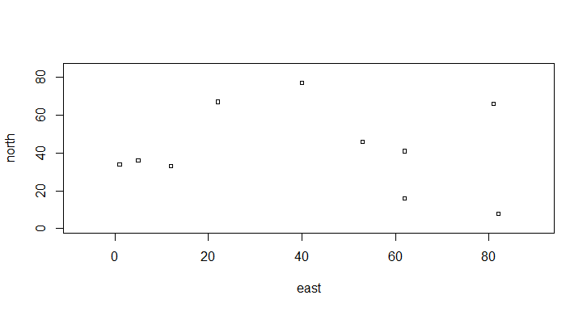
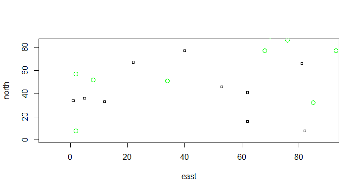
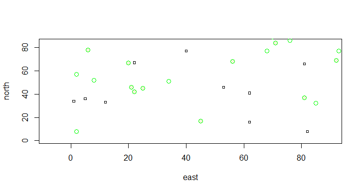
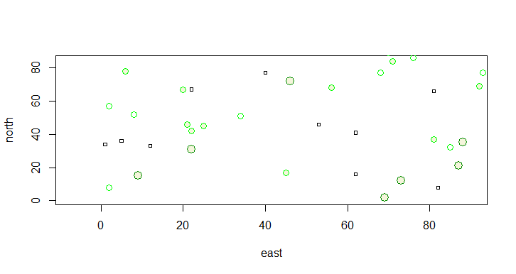
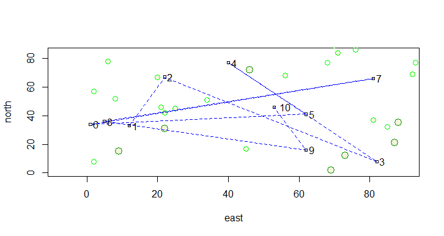
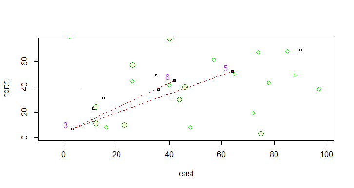
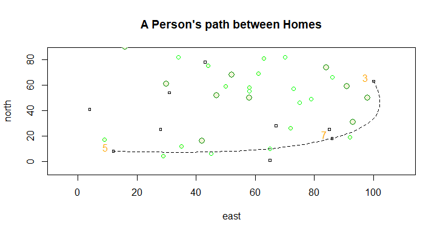

## Informal Practice - R Warmup 

### *Figure 1 - 4 : Randomly Produced Coordinates and Circles that symbolizes an area within the radius *

### Figure 5: Simulate a transportation activity for 10 labeled/ordered locations

### Figure 6: Simulate a transportation activity for only 3 labeled/ordered locations

### Figure 7: Simulate a person's path between homes (With spine path)

