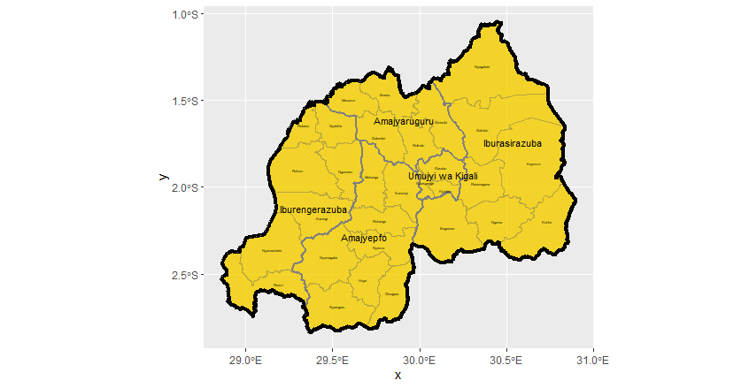
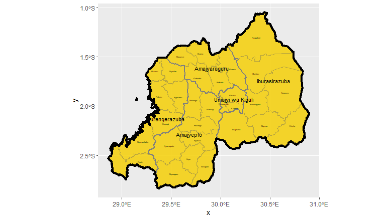
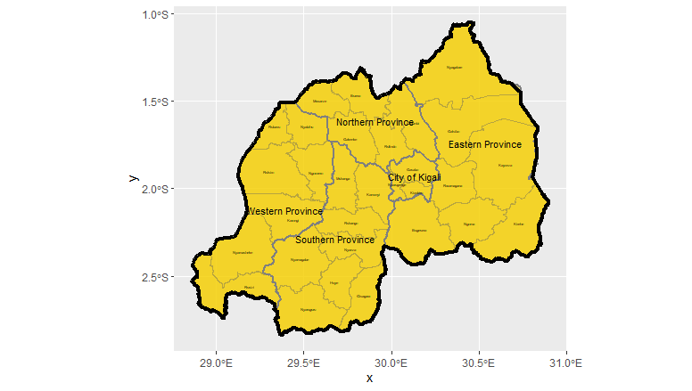
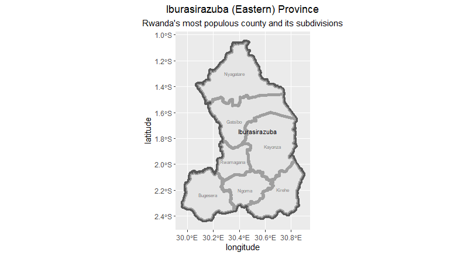

# Module 2.1 Spatial Population Description 09.06 - 09.10

The country that I am working with is Rwanda. Rwanda is one of the smaller countries in Africa in terms of land mass, with the land area of 26,338 square kilometers. The country has a population of over 12 Million.  

### Figure 1 : Administrative subdivisions for Rwanda 

## Stretch Goal 1: Comaprison of the Administrative Subdivisions with HDX and geoBoundaries 
There is a major difference between the international borders. GADM has a greater range of international borders compared to HDX data, as shown in Figure 2, the top left corner of Rwanda seems to shrink slightly compared to Figure 1. Regarding the geoBoundaries data shown in Figure 3, the map seems almost identical comapred to GADM. The minor difference is that the labels for ADM 1 are only available in English name instead of the local language. The source of the HDX data is from Office for the Coordination of Humanitarian Affairs (OCHA), whereas the source of geoBoundaries is from W&M geoLab. I think GADM and geoBoundaries are secondary sources since they are utilizing data from other research or footage that might be presented by other institutions. Meanwhile, HDX might be the only primary source, considering the OCHA is under the United Nations, the collected data might be relatively empirical and more accurate.    

### Figure 2 : Administrative subdivisions for Rwanda using HDX Shapefiles  

### Figure 3 : Administrative subdivisions for Rwanda using geoBoundaries Shapefiles  

## Stretch Goal 2: Secondary adminstrative subdivisions in Rwanda's most populous province 

